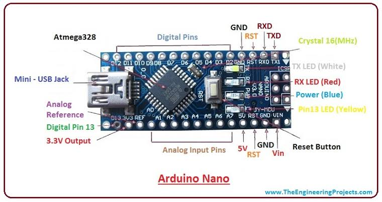

# Maze_slover
Maze slover
Ever thought about doing this? Here is the sloution,

What is Maze slover ?
The robot will slove the given 2d maze or grid in shortest path avoiding the non passable nodes by using the line following principles.

Working principle:
As mentioned earlier it uses a line following technique to traverse the maze, and to find the shortest path it uses flood fill algorithm, here for this we have developed a algorithm using the principles of flood fill and adding some features which are needed, the code for each individual step has been posted. 

Hardware requirements:
1. Arduino nao or uno or any microcontroller.
2. Motor driver module (H-brige circuit) L293d module has been used.
3. Motors of 4 nos 12V 150 RPM has been used (you can use 300 rpm motors but reduce the speed if you have any issue by using PWM)
4. Sensor - IR sensor array (8 sensors in one board)
mtp://%5Busb%3A001,003%5D/Internal%20shared%20storage/Download/sensor_array-2_large.jpg
5. Chassis - Make sure your bot size is compact (solid works design of the file is included)

Software:
Arduino IDE
Make sure you have installed stack array library for it. (link to download - https://playground.arduino.cc/Code/StackArray )

